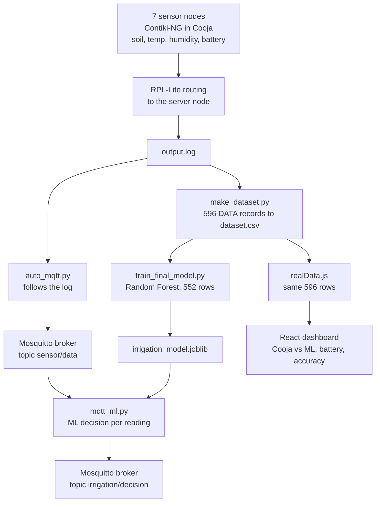

# Smart Agriculture WSN
### Sensor network simulation + MQTT pipeline + Machine Learning for irrigation decisions


> Final year project. A simulated wireless sensor network (WSN) measures soil moisture, temperature, humidity and battery level of a farm. The readings travel over MQTT to a machine learning model that decides **how much irrigation is needed (LOW / MEDIUM / HIGH)**, and a web dashboard shows what is going on.

**Live dashboard:** https://wsn-agriculture-geh840exe-ayushi2006sahus-projects.vercel.app/
**Repository:** https://github.com/Ayushi2006Sahu/WSN_Agriculture

---

## Table of contents
1. [Overview](#1-overview)
2. [Problem and motivation](#2-problem-and-motivation)
3. [Inspiration and reference paper](#3-inspiration-and-reference-paper)
4. [Results at a glance](#4-results-at-a-glance)
5. [System architecture](#5-system-architecture)
6. [How it works, step by step](#6-how-it-works-step-by-step)
7. [Machine learning model](#7-machine-learning-model)
8. [Energy-aware behaviour](#8-energy-aware-behaviour)
9. [Web dashboard](#9-web-dashboard)
10. [Repository structure](#10-repository-structure)
11. [Getting started](#11-getting-started)
12. [MQTT topics and data format](#12-mqtt-topics-and-data-format)
13. [What is real, what is simulated](#13-what-is-real-what-is-simulated)
14. [Limitations](#14-limitations)
15. [Future work](#15-future-work)
16. [Team](#16-team)
17. [References](#17-references)

---

## 1. Overview

| Layer | What it does | Technology |
|---|---|---|
| Sensor network | 7 simulated motes generate soil, temperature, humidity and battery readings and forward them to a server node | Contiki-NG, Cooja, RPL-Lite |
| Data pipeline | A script follows the Cooja log and publishes every sensor line to a broker | Python, paho-mqtt, Mosquitto |
| Intelligence | A Random Forest classifier turns soil, temperature and humidity into an irrigation decision | Python, scikit-learn |
| Dashboard | Replays the Cooja data, compares the model with the simulator's own answer, and shows battery behaviour | React, Vite, Chart.js, Vercel |

---

## 2. Problem and motivation

Farming still depends heavily on manual observation and fixed irrigation schedules. Soil can be dry while the schedule says "wait", or already wet while the schedule says "water". This wastes water, and early signs of crop stress go unnoticed.

Sensor nodes can measure the field continuously, but they run on batteries. A useful system therefore has to do two things together:

1. turn raw measurements into a clear decision (when and how much to irrigate), and
2. respect the limited energy of the sensor nodes.

This project builds that chain end to end in simulation: **sensing, routing, transport, decision, visualisation**.

---

## 3. Inspiration and reference paper

The idea for this project was inspired by:

> Haseeb, K.; Din, I.U.; Almogren, A.; Islam, N. **An Energy Efficient and Secure IoT-Based WSN Framework: An Application to Smart Agriculture.** *Sensors* 2020, 20(7), 2081. https://doi.org/10.3390/s20072081

The paper proposes an IoT-based WSN framework for smart agriculture. Sensors collect data such as soil moisture, temperature and humidity; cluster heads are chosen with a multi-criteria function (residual energy, distance to base station, signal-to-noise ratio) and forward data to the base station in a single hop; data is protected with a lightweight XOR scheme based on a linear congruential generator. The authors evaluate it in the NS2.35 simulator with 100 sensor nodes and report improvements in throughput, packet drop ratio, latency, energy consumption and routing overhead compared with other protocols.

### How this project relates to the paper

| | Reference paper | This project |
|---|---|---|
| Domain | IoT-based WSN for smart agriculture | Same domain |
| Sensed values | Soil moisture, temperature, humidity | Soil moisture, temperature, humidity, battery |
| Energy awareness | Energy-efficient cluster-head selection | Nodes adapt their reporting interval when the battery is low (see [section 8](#8-energy-aware-behaviour)) |
| Simulator | NS2.35, 100 nodes | Contiki-NG on Cooja, 7 motes, RPL-Lite routing |
| Focus | Routing, energy and security of the network | What happens to the data after the network: transport over MQTT, ML irrigation decision, dashboard |
| Machine learning | Not part of the framework | Core contribution of this project |

**What we did not implement:** cluster-head selection with SNR, the encryption scheme, and the paper's evaluation. We do not claim or reproduce the paper's reported improvements. The paper provides the motivation and the problem setting; the implementation in this repository is our own.

---

## 4. Results at a glance

| Metric | Value |
|---|---|
| Simulation length | about 18 minutes of simulated time, 7 nodes |
| Sensor records extracted from the Cooja log | **596** |
| Records used for training (battery-saving-mode rows removed) | **552** |
| Train / test split | **441 / 111** (80:20, stratified) |
| Test accuracy (Random Forest, 50 trees) | **99.10%** (110 of 111 correct) |
| Most important feature | Soil moisture (74%) |
| Reporting interval in battery-saving mode | 12.6 s → 20.7 s (about 64% longer) |

**Classification report (test set, 111 rows)**

| Class | Precision | Recall | F1 | Support |
|---|---|---|---|---|
| CRITICAL (HIGH irrigation) | 1.00 | 1.00 | 1.00 | 19 |
| NORMAL (LOW irrigation) | 1.00 | 0.98 | 0.99 | 52 |
| WARNING (MEDIUM irrigation) | 0.98 | 1.00 | 0.99 | 40 |

**Confusion matrix** (rows = actual, columns = predicted; order NORMAL, WARNING, CRITICAL)

```
[[51  1  0]
 [ 0 40  0]
 [ 0  0 19]]
```

**Feature importance:** soil 74.4%, temperature 18.4%, humidity 7.2%.

> Please read [section 13](#13-what-is-real-what-is-simulated) for how to interpret these numbers honestly. The labels come from rules inside the simulated node firmware, so a high accuracy is expected.

---

## 5. System architecture



Three lanes start from the same Cooja log:

- **A. Build the model (offline):** parse the log, clean it, train and evaluate the classifier.
- **B. Live pipeline:** log line, MQTT, ML decision, MQTT.
- **C. Dashboard:** replays the same recorded data in the browser.

---

## 6. How it works, step by step

1. **Simulation.** Seven Contiki-NG motes run in Cooja. Each one reports soil moisture, temperature, humidity and battery. RPL-Lite routing carries the data to a server node, which writes everything to `output.log`. The firmware also computes a stress value, a status and an irrigation level using fixed rules.
2. **Dataset.** `make_dataset.py` keeps only the clean client lines (`DATA Time:... Node:... Soil:...`) and writes `dataset.csv`. The log also contains routing and server messages, which are ignored. Data checks found no missing values and no duplicates.
3. **Cleaning.** 44 records are in the nodes' battery-saving mode (`PREDICT_LOW`). In that mode the label depends on the battery, not on the field, so they are excluded from training. 552 records remain.
4. **Training.** A Random Forest learns to predict crop status from soil, temperature and humidity.
5. **Transport.** `auto_mqtt.py` follows the log file and publishes each sensor line to the MQTT topic `sensor/data`.
6. **Decision.** `mqtt_ml.py` subscribes to `sensor/data`, predicts the status, maps it to an irrigation level, applies the battery rule and publishes a JSON decision to `irrigation/decision`. It also compares its answer with the simulator's own label and keeps a running match rate.
7. **Dashboard.** The React app replays the same 596 rows, shows the simulator's answer next to the model's answer, plots the real battery curves of the 7 nodes, and shows evaluation charts.

---

## 7. Machine learning model

| Item | Value |
|---|---|
| Task | 3-class classification |
| Input features | `soil`, `temp`, `hum` |
| Target | crop status: `NORMAL`, `WARNING`, `CRITICAL` |
| Mapping to irrigation | NORMAL → LOW, WARNING → MEDIUM, CRITICAL → HIGH |
| Algorithm | Random Forest, 50 trees |
| Training data | 552 records (441 train, 111 test) |
| Excluded | `PREDICT_LOW` rows (battery-saving mode) |

**MIN irrigation is not a machine learning output.** When a node's predicted battery falls below 20%, it is in energy-saving mode and the decision is `MIN`. This is a simple rule that mirrors the node firmware, and it overrides the model.

**Why only three features?** Stress is a direct formula of the same three values, and the status label is derived from it, so using it as an input would leak the answer. Battery is not an agronomic signal.

### Comparison with other models (same split, `compare_models.py`)

| Model | Test accuracy | 5-fold CV |
|---|---|---|
| Decision Tree | 100.0% | 100.0% |
| **Random Forest** | **99.1%** | 100.0% |
| SVM (MinMax scaled) | 96.4% | 96.7% |
| KNN (MinMax scaled) | 93.7% | 94.6% |
| Logistic Regression (MinMax scaled) | 78.4% | 81.7% |

Tree-based models do best because the labels are produced by threshold rules on soil and temperature, and trees learn exactly such thresholds. Random Forest is used because averaging many trees is more stable on noisy real data than a single tree.

---

## 8. Energy-aware behaviour

The nodes adapt to a low battery. Analysing the Cooja log shows:

| | Normal mode | Battery-saving mode (`PREDICT_LOW`) |
|---|---|---|
| Time between two readings | 12.6 s | 20.7 s (about 64% longer) |
| Battery drop | 5.49 % per minute | 5.13 % per minute (about 7% lower) |

This is **observational evidence** from one simulation run: the nodes report less often when the battery is low, and the saving in battery drain is small. A controlled comparison (optimisation on versus off) needs two separate simulation runs and is listed under [future work](#15-future-work).

The dashboard's Battery page also plots the real battery curve of every one of the 7 nodes (from about 98–100% down to about 11–26% over the run).

---

## 9. Web dashboard

Built with React and Vite, deployed on Vercel.

| Page | What it shows |
|---|---|
| **Predict** | Replays the Cooja rows one by one. For each row it shows the simulator's answer and the model's answer side by side (irrigation, status, stress, predicted battery), with a running match rate. |
| **Battery** | Node cards with ON/OFF sessions, a handover log and a battery calculator, plus a chart of the real battery drain of the 7 Cooja nodes. |
| **Dashboard** | Model accuracy, feature importance, classification report, class distribution of the Cooja data, and a single-task versus multi-task comparison. |
| **Farmer Guide** | Plain-language irrigation advice with English and Hindi voice support. |

The browser cannot run scikit-learn. The decision thresholds that the trained model learned are therefore implemented in JavaScript (`src/logic/mlPredictor.js`): `soil < 20` gives HIGH, `soil < 40` or `temp > 30` gives MEDIUM, otherwise LOW, with the battery rule for MIN. These thresholds reproduce the simulator's label on all 596 records.

<!--
Add screenshots to docs/images/ and uncomment:


-->

---

## 10. Repository structure

```
WSN_Agriculture/
├── src/
│   ├── components/          React components (Header, NavTabs, charts, cards)
│   ├── hooks/               voice assistant hooks
│   ├── logic/
│   │   ├── mlPredictor.js       decision rules + stress and battery estimates
│   │   ├── accuracyEngine.js    single vs multi-task accuracy (simulated noise)
│   │   ├── batteryPredictor.js  node sessions, drain and lifetime estimates
│   │   ├── realData.js          the 596 records parsed from the Cooja log
│   │   ├── sampleData.js        dataset statistics, report, demo nodes
│   │   └── tipsEngine.js        farmer advice
│   ├── pages/               Predict, Battery, Dashboard, Guide
│   └── styles/
├── python_pipeline/
│   ├── output.log               Cooja log (input)
│   ├── make_dataset.py          log to dataset.csv
│   ├── dataset.csv              596 parsed records
│   ├── train_final_model.py     trains the Random Forest, saves the model
│   ├── compare_models.py        compares 5 models, saves chart and CSV
│   ├── auto_mqtt.py             original log to MQTT bridge
│   ├── auto_mqtt_demo.py        same, portable (relative path, any paho version)
│   ├── mqtt_ml.py               MQTT subscriber that makes the irrigation decision
│   ├── replay_log.py            replays the saved log so no Cooja run is needed
│   └── ml_training_report.txt   training report
├── package.json
├── vercel.json
└── README.md
```

---

## 11. Getting started

### A. Dashboard (React)

Requirements: Node.js 18 or newer.

```bash
npm install
npm run dev        # http://localhost:5173
npm run build      # production build
```

### B. Python pipeline

Requirements: Python 3.9+, [Mosquitto](https://mosquitto.org/download/) broker.

```bash
cd python_pipeline
pip install pandas scikit-learn joblib paho-mqtt matplotlib

python make_dataset.py output.log dataset.csv   # parse the Cooja log
python train_final_model.py                     # train, prints 99.10%, saves irrigation_model.joblib
python compare_models.py                        # optional: model comparison
```

### C. Run the live demo without Cooja (replay)

On Windows the Mosquitto installer registers a background service on port 1883. If you start `mosquitto.exe` manually and see "address already in use", the broker is already running.

Open three terminals in `python_pipeline/` and start them **in this order**:

```bash
# Terminal 1: subscriber that makes the decisions
python mqtt_ml.py

# Terminal 2: log to MQTT bridge (only forwards lines written after it starts)
python auto_mqtt_demo.py

# Terminal 3: replays the saved Cooja log, one line every 0.5 s
python replay_log.py output.log live_output.log 0.5
```

Terminal 1 prints one line per reading:

```
Node 2 | Soil 29 Temp 32 Hum 73 | ML: MEDIUM (WARNING) | Cooja: MEDIUM OK | running match 100.0% (1 msgs)
```

To watch the final decisions on the output topic:

```bash
mosquitto_sub -t irrigation/decision -v
```

---

## 12. MQTT topics and data format

| Topic | Direction | Content |
|---|---|---|
| `sensor/data` | `auto_mqtt.py` → broker | one raw Cooja log line |
| `irrigation/decision` | `mqtt_ml.py` → broker | JSON decision |

**Cooja line**

```
DATA Time:5003 Node:4 Soil:66 Temp:22 Hum:70 Battery:98 PredBattery:88 Stress:... Status:... Irrigation:...
```

**Decision message**

```json
{
  "node": "2", "soil": 29, "temp": 32, "hum": 73,
  "battery": "99", "pred_battery": 94,
  "ml_status": "WARNING", "irrigation": "MEDIUM",
  "cooja_irrigation": "MEDIUM", "match": true
}
```

---

## 13. What is real, what is simulated

We want this project to be easy to evaluate honestly.

| Part | Status |
|---|---|
| Sensor readings | **Simulated** in Cooja. No physical sensors were used. |
| Labels (stress, status, irrigation) | Produced by **rules in the simulated node firmware**, not by an agronomist or field measurements. |
| Random Forest accuracy of 99.10% | Real held-out test accuracy on 111 records. It is high because the labels are rule-based and the model learns those rules. On real farm data the accuracy would be lower. |
| "Running match" in the replay demo | The replay includes records that were used for training, so it measures agreement, not generalisation. The test accuracy above is the correct generalisation figure. |
| Pipeline (log, MQTT, ML decision) | Works end to end, fed by a **replay of a recorded Cooja log**. |
| Dashboard | Replays the same recorded rows. It is **not connected to MQTT live**. |
| Battery drain curves (Battery page chart) | **Real data from the Cooja log.** |
| Battery node cards | A demo simulation; drain rates are taken from the Cooja average. |
| Predicted battery on the dashboard | An estimate from a formula based on the average Cooja drain. The simulator's drain is random (0 to 10% per cycle), so it cannot be predicted exactly (average error about 3.4 points). |
| Single-task vs multi-task accuracy drop | A **simulated interference model** (added noise), not measured in Cooja. |
| Prediction "confidence" in the dashboard | A heuristic value, not a model probability. |

---

## 14. Limitations

- No controlled energy experiment (optimisation on versus off); the energy result is observational.
- Water saving was not measured.
- The system outputs a decision only; it does not drive a pump or valve.
- The model classifies the **current** condition. It does not forecast future soil moisture.
- The dashboard is not connected to a live MQTT stream.
- No validation on real field data, and no real hardware.
- The server-side lines in the Cooja log contain corrupted fields (a serialisation issue in the simulated firmware); the pipeline avoids them by using only the clean client lines.

## 15. Future work

1. Run Cooja twice (adaptive energy optimisation on and off) and compare node lifetime.
2. Connect the dashboard to MQTT over WebSockets for live data.
3. Add actuator control (pump or valve) driven by `irrigation/decision`.
4. Collect real field data and retrain; add time-series forecasting for early stress detection.
5. Evaluate network metrics (packet delivery ratio, latency) in Cooja and explore the paper's ideas: link-quality-aware routing and lightweight data security.
6. Deploy on real hardware (for example LoRa-based nodes).

---


## 16. References

1. Haseeb, K.; Din, I.U.; Almogren, A.; Islam, N. An Energy Efficient and Secure IoT-Based WSN Framework: An Application to Smart Agriculture. *Sensors* **2020**, 20(7), 2081. https://doi.org/10.3390/s20072081
2. Contiki-NG: the OS for next generation IoT devices. https://www.contiki-ng.org
3. Winter, T. et al. RPL: IPv6 Routing Protocol for Low-Power and Lossy Networks. RFC 6550, IETF, 2012.
4. MQTT: https://mqtt.org and Eclipse Mosquitto: https://mosquitto.org
5. Pedregosa, F. et al. Scikit-learn: Machine Learning in Python. *Journal of Machine Learning Research* 12 (2011), 2825–2830.

---

_This is an academic project. Add a `LICENSE` file before reusing the code._